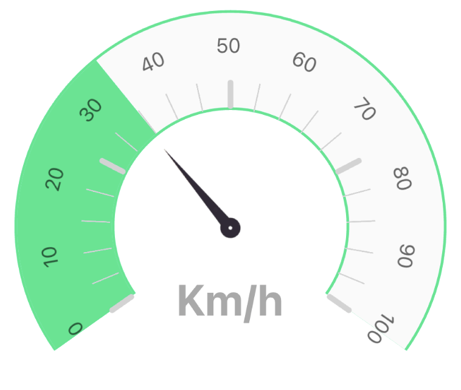

[](https://github.com/Winzana/rn-gauge/actions/workflows/ci.yml)  [](https://github.com/Winzana/rn-gauge/actions?query=workflow%3ACodeQL) [](https://github.com/semantic-release/semantic-release)

# 🍩 React Native Beautiful Gauge ✨

Performant, customizable, beautiful jauge component based on skia engine 🚀


## Preview



## Installation

```sh
yarn add @wz-mobile/rn-gauge
```

## Get Started

```jsx
import { Gauge } from '@wz-mobile/rn-gauge';

<Gauge
  emptyColor="#C1C1C1"
  colors={['cyan', 'magenta', 'yellow', 'red', 'white']}
  sweepAngle={250}
  strokeWidth={10}
  fillProgress={60}
  renderLabel={Label}
  size={200}
  thickness={60}
/>;
```

## Features

- Gradient Colors
- Sweep Angle resizeable
- Built on top of Skia
- Written in TypeScript
- Smooth Animated effect
- Use your own needle component

## Props

| Name                      | Type                                                                                                                                | Default value | Description                                                    |
| ------------------------- | ----------------------------------------------------------------------------------------------------------------------------------- | ------------- | -------------------------------------------------------------- |
| strokeWidth               | number                                                                                                                              |               | The external stroke width of the gauge                         |
| thickness                 | number                                                                                                                              | 50            | Gauge thickness                                                |
| colors _(required)_       | string\[]                                                                                                                           |               | Colors filling the gauge progress                              |
| steps                     | number\[]                                                                                                                           |               | Steps as string array to display steps on the gauge            |
| emptyColor _(required)_   | string                                                                                                                              |               | Color to display the empty part of the gauge                   |
| renderStep                | (props: { getX: GetAxisValue; getY: GetAxisValue; step: number; index: number; radius: number; rotationAngle: number; }) => Element |               | Render step function                                           |
| fillProgress _(required)_ | number                                                                                                                              |               | The progress value of the gauge.                               |
| sweepAngle _(required)_   | number                                                                                                                              | 250           | Sweep angle of gauge, default is 250 ( how wide is the gauge ) |
| renderNeedle              | (params: { getNeedleStyle: GetNeedleStyle; }) => ReactNode                                                                          |               | Render prop for needle component, default is null              |
| renderLabel _(required)_  | () => ReactNode                                                                                                                     |               | Method to render the label center of the gauge                 |
| size _(required)_         | number                                                                                                                              |               | Size given to the component                                    |
| canvasStyle               | StyleProp&lt;ViewStyle>                                                                                                             |               | Custom Canvas style                                            |
| shadowProps               | AnimatedProps&lt;ShadowProps>                                                                                                       |               | Shadow props if wanted, could provide nice shadow effects      |
| springConfig              | SpringConfig                                                                                                                        |               | Spring config for fill progress animation                      |
| showGaugeCenter           | boolean                                                                                                                             |               | Show gauge center                                              |

## Use your own needle component

This sample shows you how to use a custom needle component, it's recommended to set showGaugeCenter to true to
fine tune the parameters passed to `getNeedleStyle` function.

```jsx
const SimpleNeedle: GaugeProps['renderNeedle'] = ({ getNeedleStyle }) => (
  <>
    <Animated.View style={[getNeedleStyle(80, 80, 14.5, 0, -7.6)]}>
      <AnimatedImage
        style={{ width: 80, height: 80 }}
        resizeMode="contain"
        source={SimpleNeedleImage}
      />
    </Animated.View>
  </>
);
```

## What is sweepAngle ?


## Highly customizable

<div style="display:flex;flex-direction:row;width:100%; justify-content:space-around;">
  
  
</div>

## To Do

- [ ] RTL Support

## Full Sample

You can check full sample in `App.tsx` located in the example folder for more details about implementation.

## Contributing

See the [contributing guide](CONTRIBUTING.md) to learn how to contribute to the repository and the development workflow.

## License

MIT
